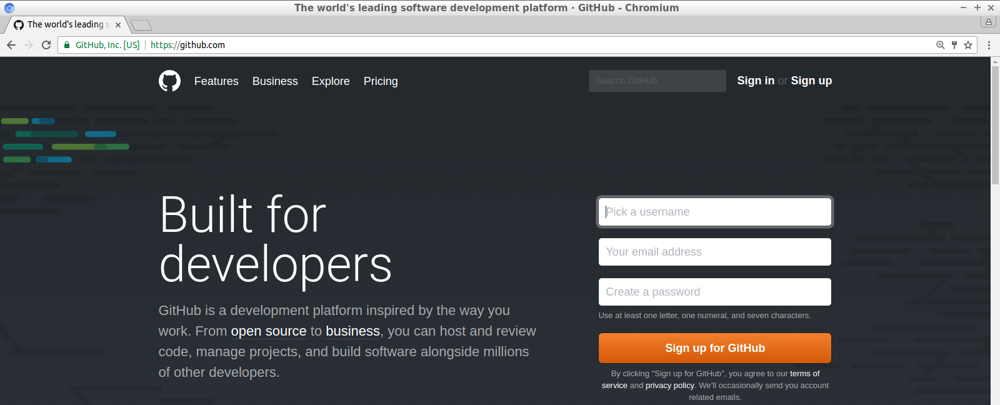

# simplify_cpp_travis_intro

[Article](https://github.com/richelbilderbeek/articles) for 'Simplify C++!', 'Continuous integration with Travis CI'.

The article is in progress and spontaneous feedback is welcomed. Feel encouraged to do so, by posting an Issue.

# Continuous integration with Travis CI


Minecraft players can tell you: automation is great! It usually takes some time to set up, but then
you profit indefinitely. But where my minor programming students set up some Minecraft farming
contraption, I like to harvest as much information from my code that I get get. This ranges from
the basic question 'Does it build (today)?' to getting code coverage, profiling information and whatever
I choose.


This article introduces how to add continuous integration and other goodies to your code.

There are many advantages of setting up a continuous integration service:

 * Errors are detected directly after a commit
 * The build script shows all steps to build your project, and is tested to work
 * Code can be analysed statically, that, as a bonus, may aid beginners learning the language
 * Quality can be enforced in incoming Pull Requests
 * Run-time profiling can be 

There are some potential disadvantages of setting up a continuous integration service:

 * Disruption of the work process due to a false negative (for example, a Heisenbug)
 * It takes some time to set up
 * For commercial development, a continuous integration service comes with a price

This article will show these setups in detail:

 * Building a C++98 Hello World program
 * Building a C++17 Hello World program
 * Adding static code analysis by `cppcheck`
 * Profiling your code

Some more extensions are mentioned before concluding that
adding continuous integration to your build is beneficial
for beginners, novices and experts.

## The tools I use are just an example

This article shows some advantages using a continuous
integration service. To have complete examples, I had
to pick some specific programs/websites/services out of many.

In the table below, you can see the tools I picked for this article, and alternatives
that probably are just as good:

Tools I will be using|Examples of alternatives that are just as good
---|---
`git`|BitKeeper, Gnu Bazaar, Mercurial
GitHub|BitBucket, Sourceforge,GNU Savannah
Travis CI|Jenkins, Appveyor, Codeship, Wercker
GCC|`clang`
`cppcheck`|`clang-tidy`, OCLint
`gprof`|`perf`

There is some synergy between GitHub and Travis: one can login to Travis
using a GitHub account.

## Setting up GitHub and Travis

Setting up GitHub and Travis is very straightforward. Here a global overview of
what needs to be done.

To setup a GitHub account, go to [https://github.com](https://github.com).



Setting up an account is easy. For free and open source development, this is free.

To setup a Travis account, go to [https://travis-ci.org](https://travis-ci.org).


Using your GitHub account, this is a breeze. 

Travis will show you all GitHub repository you have. You will have to activate these
by clicking on a slider:


After submitting your first Travis script, Travis will take you to a different
first dialog. This dialog shows the build status of all GitHubs checked by Travis:


## Building a C++98 Hello World program

The first example shows how to test that a C++98 Hello World program compiles.

This is the code that will be built:

```
#include <iostream>

int main() 
{
  std::cout << "Hello world\n";
}
```

Travis needs to be instructed what to do when triggered.
These instruction must be put in a file named `.travis.yml`
and looks like this:

```
language: cpp
compiler: gcc

script: 
  - g++ main.cpp -o travis_gcc_cpp98
  - ./travis_gcc_cpp98
```

First, the language and compiler are specified. In the `script` part, the project is built and then run.

When Travis CI is triggered, it will result in the following build log:


From this day on, we have code that is checked to compile everytime the code changes.
Also, the same happens if a Pull Request is sent to us: already before merging, GitHub
shows if that merge will break the build.

## Building a C++17 Hello World program

To celebrate C++17 has been completed [1], I will add a C++17 feature:

```
#include <iostream>

int main() 
{
  static_assert("C++17");
  std::cout << "Hello world\n";
}
```

To build this project successfully, a more elaborate Travis build script is needed:

```
language: cpp
compiler: gcc
dist: trusty

before_install:
  - sudo add-apt-repository -y ppa:ubuntu-toolchain-r/test
  - sudo apt-get update -qq

install: 
  - sudo apt-get install -qq g++-6
  - sudo update-alternatives --install /usr/bin/g++ g++ /usr/bin/g++-6 90

script: 
  - g++ main.cpp -std=c++17 -o travis_gcc_cpp17
  - ./travis_gcc_cpp17
```

Travis will setup a newer distro (Trusty Tahr), instead of the one used by default (Precise Pangolin).
A PPA is added for (even) newer packages and `g++-6` is installed. Then `g++` is redirected to use `g++-6`.


This Travis script is one of many ways to achieve the same and not necessarily the best in all aspects. 
Feel encouraged to suggest improvements to any of the GitHubs used in this article. As when you'd
submit me a Pull Request, Travis will show me both if this C++17 code still compiles and how
long it took to run the script.


## Adding static code analysis by `cppcheck`

Spot the bug:

```
int main() 
{
  int a[3] = { 0, 1, 2 };
  a[3] = 4;
}
```

For an experienced C++ developer, this is all too easy. 
But for someone stepping in from another language, it may be not,
as not all programming languages have arrays starting at index zero. 
Additionally, access violations are usually more conspicuous. 

A static code analysis tool should be able to detect this access violation
and give a friendly reminder to the person that wrote the code.

This Travis script tests the project to build and tests the code statically with `cppcheck`:

```
language: cpp
compiler: gcc
dist: trusty

before_install:
  # C++17
  - sudo add-apt-repository -y ppa:ubuntu-toolchain-r/test
  - sudo apt-get update -qq

install: 
  # C++17
  - sudo apt-get install -qq g++-6
  - sudo update-alternatives --install /usr/bin/g++ g++ /usr/bin/g++-6 90
  # cppcheck
  - sudo apt-get install -qq cppcheck

script: 
  # Build and run this project
  - g++ main.cpp -std=c++17 -o travis_gcc_cpp17_cppcheck
  - ./travis_gcc_cpp17_cppcheck
  # cppcheck
  - cppcheck --quiet --error-exitcode=1 . 
```

Since the previous build script, little has changed. In the `install` section, `cppcheck` is installed.
In the `script` section, `cppcheck` is called to test the files in its folder.

This is the Travis output:


Great, Travis and `cppcheck` have detected this problem.
Due to this, the Travis build has failed.
The person that submitted this commit may have been reminded that in C++ indices at zero.

Adding static code analysis tools to a Travis scripts do not only help experts. 
As in this example, it may help teach beginners. It will give them a friendly reminder
about how the language works, instead of a segmentation fault that may-or-may-not occur.

## Profiling your code

Some beginner C++ programmers have an obsession with run-time speed. 
It is known we should prefer measuring over following a gut-feeling,
but a beginner may not know how to do profiling.

In this example, the rutime speed of `std::sort` is compared against a handcrafted ('lightning fast!')
function:

```
#include <algorithm>
#include <cassert>
#include <iostream>
#include <numeric>
#include <vector>

std::vector<int> sort_a(std::vector<int> v)
{
 const auto sz = v.size();
  for(auto i = 0u; i != sz-1; ++i)
  {
    for(auto j = 0u; j != sz-i-1; ++j)
    {
      if(v[j] > v[j+1])
      {
        std::swap(v[j], v[j+1]);
      }
    }
  }
  return v;
}

std::vector<int> sort_b(std::vector<int> v)
{
  std::sort(std::begin(v), std::end(v));
  return v;
}

auto create_series()
{
  const int sz{100'000};
  std::vector<int> v(sz);
  std::iota(std::begin(v), std::end(v), 0);
  std::reverse(std::begin(v), std::end(v));
  return v;
}

int main()
{
  assert(!"Do not profile in debug mode");
  const auto v = create_series();
  const auto a = sort_a(v);
  const auto b = sort_b(v);
  if (a != b) return 1;
}
```

The two sorting implementation work on the same input and are checked to have the same output.
The exact working of `sort_a` (psst, a bubble sort!) is unimportant. 
The assert statement ensures that profiling is done in release mode.

Travis runs and profiles the code with the following script:

```
language: cpp
compiler: gcc
dist: trusty

before_install:
  # C++17
  - sudo add-apt-repository --yes ppa:ubuntu-toolchain-r/test
  - sudo apt-get update -qq

install: 
  # C++17
  - sudo apt-get install -qq g++-6
  - sudo update-alternatives --install /usr/bin/g++ g++ /usr/bin/g++-6 90

script: 
  - g++ main.cpp -DNDEBUG -O2 -pg -std=c++17 -o travis_gcc_cpp17_gprof
  - ./travis_gcc_cpp17_gprof 
  # produce the gprof log
  - gprof ./travis_gcc_cpp17_gprof  > gprof.log
  - head gprof.log -n 100
```

There is not much new in the script. The code *is* compiled differently to
enable a release mode with `gprof` annotations. After running the code,
a profiling log is created, as shown here:


It shows clearly that `std::sort` heavily outcompeted the 'lightning fast!' function.

This profiling example only shows two implementations competing with each other. That
could also be measured using an STL timer. Profiling information gets more interesting
when a project grows, when there are dozens of functions. It helps showing which
functions take up the majority of the computation time. And it teaches beginners that
most functions are irrelevant to optimize. 

## Other extensions

I add much more checks to my projects:

Task|Examples
---|---
Run a test suite|Boost.Test, QTest
Measuring code coverage|`gcov` and Codecov
Checking for style|OCLint
Detecting memory leaks|`valgrind`
Checking for undefined behavior|UBSAN, `tsan`
Check if the documentation has stylistic issues|`proselint`

An overview of all my work can be viewed in 
[my Travis CI C++ tutorial](https://github.com/richelbilderbeek/travis_cpp_tutorial). 
If I do not use your favorite tool yet, I'd be happy to add it to my battery of tools.

## Conclusion

We know automation is good. GitHub and Travis happily do whatever you'd like them to do.
Setting up is easy: you'll need a GitHub account and a Travis script that has all your needs.
Not only will continuous integration help an expert in finding those hard-to-find bugs,
but it will also aid a beginner in leaning C++.

## External links

 * [Trip report: Winter ISO C++ standards meeting (Kona), C++17 is complete](https://herbsutter.com/2017/03/24/trip-report-winter-iso-c-standards-meeting-kona-c17-is-complete)
 * [My Travis CI C++ tutorial](https://github.com/richelbilderbeek/travis_cpp_tutorial)
 * [GitHub of 'Building a C++98 Hello World program'](https://github.com/richelbilderbeek/travis_gcc_cpp98) 
 * [GitHub of 'Building a C++17 Hello World program'](https://github.com/richelbilderbeek/travis_gcc_cpp17) 
 * [GitHub of 'Adding static code analysis by `cppcheck`'](https://github.com/richelbilderbeek/travis_gcc_cpp17_cppcheck)
 * [GitHub of 'Profiling your code'](https://github.com/richelbilderbeek/travis_gcc_cpp17_gprof)

## Bio

I enjoy to teach programming following the industry's highest standards. 
My students, aged 7-77 years, are all confronted with quotes of advice 
from the literature, especially from 'The Pragmatic Programmer' 
by Andrew Hunt and David Thomas. After 16 years of experience in C++, I
enjoy to see my students pursue a same dead end I once took, and prevent
them wasting their time too long on it.
